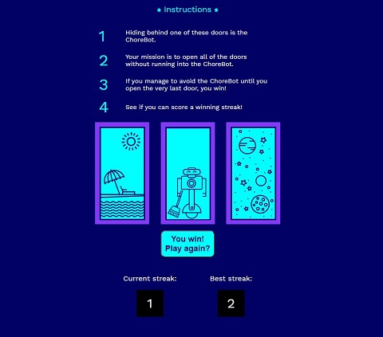

# Chore Door

This project was completed as part of Codecademy's Building Interactive JavaScript Websites course. As part of the JavaScript Interactive Websites tutorial we were required to utilize HTML, CSS, and JavaScript to construct a single-page dynamic website that plays a fully-functional game. We built out every feature of the game and it's functionality one step at a time creating the index.html structure, the design in style.css and finally all of the functions and event handlers in the script.js file.

## Table of Contents

- [Technologies](#technologies)
- [Screenshots](#screenshots)
- [Status](#status)

## Technologies

This project was created with:

- JavaScript ES6
- HTML5
- CSS3

## Screenshots

## Status

This project has been completed.